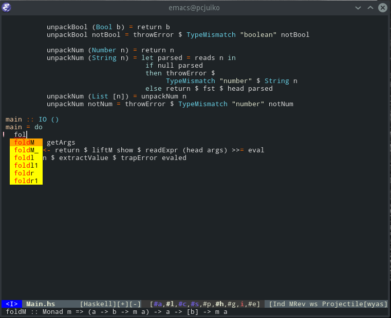

company-ghci
============

Description
-----------
company-ghci is a company backend that provides completions for the haskell programming language by talking to a ghci process.

Requeriments
------------
* company
* haskell-mode

Usage
-----
	(require 'company-ghci)
	(add-to-list 'company-backends 'company-ghci)
	(add-hook 'haskell-mode-hook 'company-mode)
	(add-hook 'haskell-interactive-mode-hook 'company-mode)
